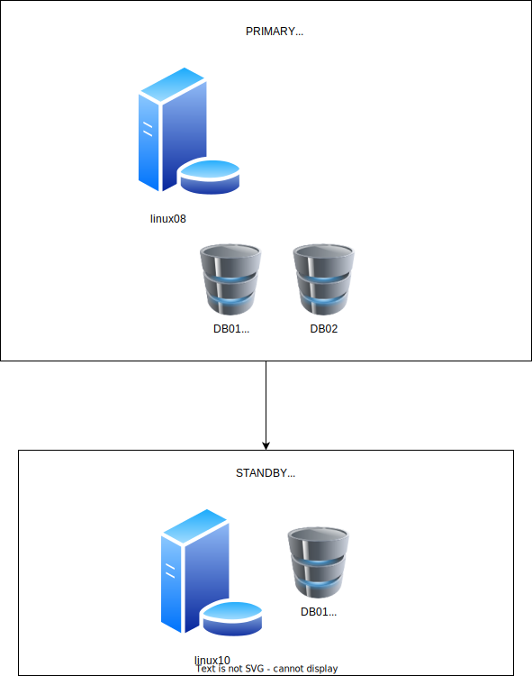

<!-- ---
documentclass: article
lang: pt-BR

title: Procedimento para conversão de Single-Instance para RAC 19c
author: Lucas Pimentel Lellis
--- -->

# Procedimento para Conversão de Single-Instance para RAC 19c

## Objetivo

Documentar o processo de conversão in-place de bases Single-Instance para RAC na versão 19.21.

A conversão observará os seguintes passos:

* Clone da máquina original para criar o nó 2
* Deconfig do Grid Infrastructure - nó 2
* Detach do Grid Infrastructure - nó 2
* Attach do Grid Infrastructure - nó 2
* Config do Grid Infrastructure em modo cluster - nó 2
* Relink dos binários do Oracle Database ativando a option de RAC - nó 2
* Stop das instâncias - nó 1
* Subida das instâncias, configuração de parâmetros, tablespace de undo, redo logs e serviços - nó 2
* Deconfig do Grid Infrastructure - nó 1
* Detach do Grid Infrastructure - nó 1
* Attach do Grid - nó 1
* add_node.sh do nó 1 - executado a partir do nó 2

## Estrutura

* Cenário Inicial

  

* Cenário Final

  

* Dados das Máquinas

  |            | Primary        | Primary        | Standby         |
  |------------|----------------|----------------|-----------------|
  |            | Nó 1           | Nó 2           | Single-Instance |
  | Hostname   | linux08        | linux09        | linux10         |
  | IP público | 192.168.49.18  | 192.168.49.19  | 192.168.49.20   |
  | IP privado | 192.168.39.18  | 192.168.39.19  | 192.168.39.20   |
  | VIP        | 192.168.49.218 | 192.168.49.219 | 192.168.49.220  |
  | Porta VNC  | 55909          | 55910          | 55911           |

  | SCAN       | IP             |
  |------------|----------------|
  | rac02-scan | 192.168.49.206 |
  | rac02-scan | 192.168.49.207 |
  | rac02-scan | 192.168.49.208 |

  | Disco     | Tamanho (GB) |
  |-----------|-------------:|
  | u01       |           80 |
  | OCRVOTE01 |           10 |
  | OCRVOTE01 |           10 |
  | OCRVOTE01 |           10 |
  | DATA01    |           20 |
  | FRA01     |           20 |

## Configuração do Nó 2

### Configure o Login Sem Senha via SSH

Após adicionar as chaves públicas no `.ssh/authorized_keys` de cada nó, execute os comandos abaixo para que as
assinaturas de cada máquina estejam presentes no `.ssh/known_hosts` de cada máquina:

```{.default .NumberLines}
ssh linux08 date
ssh linux09 date
ssh linux08-priv date
ssh linux09-priv date
```

### Clone do Nó 1

Foi feito o clone do disco correspondente ao /u01 do nó 1. Além disso, foram apresentados para o nó 2 os mesmos discos de ASM do nó 1.

### Deconfig do Grid Infrastructure - Nó 2

Executar com o usuário root:

```{.bash .numberLines}
/u01/app/oraInventory/orainstRoot.sh
/u01/app/19.21/grid/crs/install/roothas.sh -deconfig -force
mv /u01/app/19.21/grid/crs/install/crsgenconfig_params /u01/app/19.21/grid/crs/install/crsgenconfig_params.$(date '+%Y%m%d%H%M%S')
```

Resultado:

```default
[root@linux09 ~]# /u01/app/19.21/grid/crs/install/roothas.sh -deconfig -force
Using configuration parameter file: /u01/app/19.21/grid/crs/install/crsconfig_params
The log of current session can be found at:
  /u01/app/grid/crsdata/linux09/crsconfig/hadeconfig.log
2023/12/18 15:39:23 Oracle Clusterware infrastructure error in CLSECHO (OS PID 9146): ADR home path /u01/app/grid/diag/crs/linux09/crs does not exist; ADR initialization will try to create it
 CLSRSC-752: incorrect invocation of script roothas.pl called on a Grid Infrastructure cluster node
Died at /u01/app/19.21/grid/crs/install/crsutils.pm line 18567.
The command '/u01/app/19.21/grid/perl/bin/perl -I/u01/app/19.21/grid/perl/lib -I/u01/app/19.21/grid/crs/install -I/u01/app/19.21/grid/xag /u01/app/19.21/grid/crs/install/roothas.pl -deconfig -force' execution failed
[root@linux09 ~]#
```

Altere as permissões dos arquivos:

```{.bash .numberLines}
cd /u01/app

chown -R oracle:oinstall 19.21
```

Resultado:

```default
[root@linux09 ~]# cd /u01/app
[root@linux09 app]#
[root@linux09 app]# chown -R oracle:oinstall 19.21
[root@linux09 app]#
[root@linux09 app]#
```

### Detach do Grid Infrastructure - nó 2

Executar com o usuário oracle (ou grid, caso faça a separação):

```{.bash .numberLines}
/u01/app/19.21/grid/oui/bin/runInstaller \
  -waitforcompletion                     \
  -silent                                \
  -local                                 \
  -detachHome                            \
    CRS=false                            \
    ORACLE_HOME="/u01/app/19.21/grid"    \
    INVENTORY_LOCATION=/u01/app/oraInventory
```

Resultado:

```default
[oracle@linux09 db01 ~]$ /u01/app/19.21/grid/oui/bin/runInstaller -waitforcompletion -silent -local -detachHome CRS=false ORACLE_HOME="/u01/app/19.21/grid" INVENTORY_LOCATION=/u01/app/oraInventory
Starting Oracle Universal Installer...

Checking swap space: must be greater than 500 MB.   Actual 22554 MB    Passed
The inventory pointer is located at /etc/oraInst.loc
You can find the log of this install session at:
 /u01/app/oraInventory/logs/DetachHome2023-12-18_03-41-35PM.log
'DetachHome' was successful.
[oracle@linux09 db01 ~]$
```

### Limpe o Home do Grid Infrastructure - Nó 2

Executar com o usuário root:

```{.bash .numberLines}
export GRID_HOME=/u01/app/19.21/grid
rm -rf $GRID_HOME/host_name
rm -rf $GRID_HOME/log/host_name
rm -rf $GRID_HOME/gpnp/*
rm -rf $GRID_HOME/bin/clsecho/*
rm -rf $GRID_HOME/crs/init/*
rm -rf $GRID_HOME/cdata/*
rm -rf $GRID_HOME/crf/*
rm -rf $GRID_HOME/network/admin/*.ora
rm -rf $GRID_HOME/root.sh*
rm -rf $GRID_HOME/cfgtoollogs/*
rm -rf $GRID_HOME/crs/install/crs*config_params
rm -rf $GRID_HOME/rdbms/audit/*
rm -rf $GRID_HOME/rdbms/log/*
rm -rf $GRID_HOME/inventory/backup/*
rm -rf $GRID_HOME/oraInst.loc
rm -rf /u01/app/grid/*
find $GRID_HOME -name '*.ouibak*' -delete
```

### Instale o RPM do cluvfy

Executar com o root:

```{.bash .numberLines}
yum install -y /u01/app/19.21/grid/cv/rpm/cvuqdisk-1.0.10-1.rpm
```

### Config do Grid Infrastructure em Modo Cluster - Nó 2

Executar com o usuário oracle (ou grid, caso faça a separação) a checagem de pré-requisitos:

```{.bash .numberLines}
unset ORACLE_HOME

cd /u01/app/19.21/grid

./gridSetup.sh                                                                                       \
    -silent                                                                                          \
        oracle.install.responseFileVersion=/oracle/install/rspfmt_crsinstall_response_schema_v19.0.0 \
        INVENTORY_LOCATION=/u01/app/oraInventory                                                     \
        oracle.install.option=CRS_CONFIG                                                             \
        ORACLE_BASE=/u01/app/grid                                                                    \
        oracle.install.asm.OSDBA=asmdba                                                              \
        oracle.install.asm.OSOPER=asmoper                                                            \
        oracle.install.asm.OSASM=asmadmin                                                            \
        oracle.install.crs.config.scanType=LOCAL_SCAN                                                \
        oracle.install.crs.config.gpnp.scanName=rac02-scan                                           \
        oracle.install.crs.config.gpnp.scanPort=1521                                                 \
        oracle.install.crs.config.ClusterConfiguration=STANDALONE                                    \
        oracle.install.crs.config.configureAsExtendedCluster=false                                   \
        oracle.install.crs.config.clusterName=rac02                                                  \
        oracle.install.crs.config.gpnp.configureGNS=false                                            \
        oracle.install.crs.config.autoConfigureClusterNodeVIP=false                                  \
        oracle.install.crs.config.gpnp.gnsOption=CREATE_NEW_GNS                                      \
        oracle.install.crs.config.clusterNodes='linux09:linux09-vip'                                 \
        oracle.install.crs.config.networkInterfaceList='eth1:192.168.49.0:1,eth2:192.168.39.0:5'     \
        oracle.install.crs.configureGIMR=false                                                       \
        oracle.install.asm.configureGIMRDataDG=false                                                 \
        oracle.install.crs.config.storageOption=FLEX_ASM_STORAGE                                     \
        oracle.install.crs.config.sharedFileSystemStorage.ocrLocations=                              \
        oracle.install.crs.config.useIPMI=false                                                      \
        oracle.install.asm.SYSASMPassword=<SENHA>                                                    \
        oracle.install.asm.diskGroup.name=OCRVOTE                                                    \
        oracle.install.asm.diskGroup.redundancy=NORMAL                                               \
        oracle.install.asm.diskGroup.AUSize=4                                                        \
        oracle.install.asm.diskGroup.disks='/dev/vdd,/dev/vde,/dev/vdf'                              \
        oracle.install.asm.diskGroup.diskDiscoveryString='/dev/vd*'                                  \
        oracle.install.asm.monitorPassword=<SENHA>                                                   \
        oracle.install.asm.gimrDG.AUSize=1                                                           \
        oracle.install.asm.configureAFD=true                                                         \
        oracle.install.crs.configureRHPS=false                                                       \
        oracle.install.crs.config.ignoreDownNodes=false                                              \
        oracle.install.config.managementOption=NONE                                                  \
        oracle.install.config.omsPort=0                                                              \
        oracle.install.crs.rootconfig.executeRootScript=false                                        \
    -waitForCompletion                                                                               \
    -executePrereqs
```

Executar com o usuário oracle (ou grid, caso faça a separação) a configuração em nohup:

```{.bash .numberLines}
unset ORACLE_HOME

cd /u01/app/19.21/grid

nohup ./gridSetup.sh                                                                                 \
    -silent                                                                                          \
        oracle.install.responseFileVersion=/oracle/install/rspfmt_crsinstall_response_schema_v19.0.0 \
        INVENTORY_LOCATION=/u01/app/oraInventory                                                     \
        oracle.install.option=CRS_CONFIG                                                             \
        ORACLE_BASE=/u01/app/grid                                                                    \
        oracle.install.asm.OSDBA=asmdba                                                              \
        oracle.install.asm.OSOPER=asmoper                                                            \
        oracle.install.asm.OSASM=asmadmin                                                            \
        oracle.install.crs.config.scanType=LOCAL_SCAN                                                \
        oracle.install.crs.config.gpnp.scanName=rac02-scan                                           \
        oracle.install.crs.config.gpnp.scanPort=1521                                                 \
        oracle.install.crs.config.ClusterConfiguration=STANDALONE                                    \
        oracle.install.crs.config.configureAsExtendedCluster=false                                   \
        oracle.install.crs.config.clusterName=rac02                                                  \
        oracle.install.crs.config.gpnp.configureGNS=false                                            \
        oracle.install.crs.config.autoConfigureClusterNodeVIP=false                                  \
        oracle.install.crs.config.gpnp.gnsOption=CREATE_NEW_GNS                                      \
        oracle.install.crs.config.clusterNodes='linux09:linux09-vip'                                 \
        oracle.install.crs.config.networkInterfaceList='eth1:192.168.49.0:1,eth2:192.168.39.0:5'     \
        oracle.install.crs.configureGIMR=false                                                       \
        oracle.install.asm.configureGIMRDataDG=false                                                 \
        oracle.install.crs.config.storageOption=FLEX_ASM_STORAGE                                     \
        oracle.install.crs.config.sharedFileSystemStorage.ocrLocations=                              \
        oracle.install.crs.config.useIPMI=false                                                      \
        oracle.install.asm.SYSASMPassword=<SENHA>                                                    \
        oracle.install.asm.diskGroup.name=OCRVOTE                                                    \
        oracle.install.asm.diskGroup.redundancy=NORMAL                                               \
        oracle.install.asm.diskGroup.AUSize=4                                                        \
        oracle.install.asm.diskGroup.disks='/dev/vdd,/dev/vde,/dev/vdf'                              \
        oracle.install.asm.diskGroup.diskDiscoveryString='/dev/vd*'                                  \
        oracle.install.asm.monitorPassword=<SENHA>                                                   \
        oracle.install.asm.gimrDG.AUSize=1                                                           \
        oracle.install.asm.configureAFD=true                                                         \
        oracle.install.crs.configureRHPS=false                                                       \
        oracle.install.crs.config.ignoreDownNodes=false                                              \
        oracle.install.config.managementOption=NONE                                                  \
        oracle.install.config.omsPort=0                                                              \
        oracle.install.crs.rootconfig.executeRootScript=false                                        \
    -waitForCompletion > ~/grid_config.log 2>&1 0</dev/null &

tail -100f ~/grid_config.log
```

Resultado:

```default
Launching Oracle Grid Infrastructure Setup Wizard...

[WARNING] [INS-40109] The specified Oracle Base location is not empty on this server.
   ACTION: Specify an empty location for Oracle Base.
[WARNING] [INS-13013] Target environment does not meet some mandatory requirements.
   CAUSE: Some of the mandatory prerequisites are not met. See logs for details. /u01/app/oraInventory/logs/GridSetupActions2023-12-18_04-35-03PM/gridSetupActions2023-12-18_04-35-03PM.log
   ACTION: Identify the list of failed prerequisite checks from the log: /u01/app/oraInventory/logs/GridSetupActions2023-12-18_04-35-03PM/gridSetupActions2023-12-18_04-35-03PM.log. Then either from the log file or from installation manual find the appropriate configuration to meet the prerequisites and fix it manually.
The response file for this session can be found at:
 /u01/app/19.21/grid/install/response/grid_2023-12-18_04-35-03PM.rsp

You can find the log of this install session at:
 /u01/app/oraInventory/logs/GridSetupActions2023-12-18_04-35-03PM/gridSetupActions2023-12-18_04-35-03PM.log

As a root user, execute the following script(s):
  1. /u01/app/19.21/grid/root.sh

Execute /u01/app/19.21/grid/root.sh on the following nodes:
[linux09]


Successfully Setup Software with warning(s).
As install user, execute the following command to complete the configuration.
  /u01/app/19.21/grid/gridSetup.sh -executeConfigTools -responseFile /u01/app/19.21/grid/install/response/grid_2023-12-18_04-35-03PM.rsp [-silent]
Note: The required passwords need to be included in the response file.
```

Execute como root o script `/u01/app/19.21/grid/root.sh`:

```{.bash .numberLines}
nohup /u01/app/19.21/grid/root.sh > ~/grid_root.log 2>&1 0</dev/null &

tail -100f ~/grid_root.log
```

Resultado:

```default
2023/12/18 16:51:29 CLSRSC-594: Executing installation step 17 of 19: 'StartCluster'.
2023/12/18 16:51:49 CLSRSC-4002: Successfully installed Oracle Trace File Analyzer (TFA) Collector.
2023/12/18 16:52:29 CLSRSC-343: Successfully started Oracle Clusterware stack
2023/12/18 16:52:29 CLSRSC-594: Executing installation step 18 of 19: 'ConfigNode'.
2023/12/18 16:53:46 CLSRSC-594: Executing installation step 19 of 19: 'PostConfig'.
2023/12/18 16:54:07 CLSRSC-325: Configure Oracle Grid Infrastructure for a Cluster ... succeeded
```

Insira as senhas no responseFile gerado pelo gridSetup.sh (exemplo: `/u01/app/19.21/grid/install/response/grid_2023-12-18_04-35-03PM.rsp`)
e execute com o usuário oracle (ou grid, caso faça a separação):

```{.default .numberLines}
As install user, execute the following command to complete the configuration.
  /u01/app/19.21/grid/gridSetup.sh -executeConfigTools -responseFile /u01/app/19.21/grid/install/response/grid_2023-12-18_04-35-03PM.rsp [-silent]
Note: The required passwords need to be included in the response file.
```

### Relink dos binários do Oracle Database ativando a option de RAC - Nó 2

Executar com o usuário oracle:

```{.bash .numberLines}
export ORACLE_HOME=/u01/app/oracle/product/19.21/db_1
export PATH=$ORACLE_HOME/bin:$PATH
export LD_LIBRARY_PATH=$ORACLE_HOME/lib
cd /u01/app/oracle/product/19.21/db_1/rdbms/lib
make -f ins_rdbms.mk  rac_on ioracle
```

### Stop dos bancos - Nó 1

```{.bash .numberLines}
srvctl stop database -d db01_prim -o immediate
srvctl stop database -d db02 -o immediate
sudo /u01/app/19.21/grid/bin/crsctl stop has
sudo /u01/app/19.21/grid/bin/crsctl disable has
```

### Subida dos diskgroups - Nó 2

```{.sql .numberLines}
alter diskgroup DATA mount;
alter diskgroup FRA mount;
```

### Subida das instâncias, configuração de parâmetros, tablespace de undo, redo logs e serviços - Nó 2

#### Banco db01

Como o Oracle Home do banco veio na cópia do disco /u01, não é necessário copiar os arquivos do $ORACLE_HOME/dbs.

Suba o banco em single-instance:

```{.bash .numberLines}
echo db012:/u01/app/oracle/product/19.21/db_1:N >> /etc/oratab
. oraenv <<< db012
echo "spfile='+data/db01_prim/parameterfile/spfile.270.1155572117'" > /u01/app/oracle/product/19.21/db_1/initdb012.ora

export ORACLE_HOME=/u01/app/oracle/product/19.21/db_1
export PATH=$ORACLE_HOME/bin:$PATH
export LD_LIBRARY_PATH=$ORACLE_HOME/lib
export ORACLE_SID=db012
sqlplus / as sysdba <<ENDEND
startup restrict
exit
ENDEND
```

Crie a thread adicional de redo, os novos redo log groups e os novos tablespace de UNDO:

```{.sql .numberLines}
alter database add logfile thread 2 size 200m;
alter database add logfile thread 2 size 200m;
alter database add logfile thread 2 size 200m;
alter database add standby logfile thread 2 size 200m;
alter database add standby logfile thread 2 size 200m;
alter database add standby logfile thread 2 size 200m;
alter database add standby logfile thread 2 size 200m;
create undo tablespace undotbs2 datafile size 200m autoextend on next 100m;
alter database enable public thread 2;
```

Crie um pfile a partir do spfile:

```{.bash .numberLines}
create pfile='?/dbs/initdb012_modificado.ora' from spfile;
```

Inclua/Altere os seguintes parâmetros:

```{.default .numberLines}
db011.instance_number=1
db012.instance_number=2
db011.undo_tablespace=UNDOTBS1
db012.undo_tablespace=UNDOTBS2
db011.local_listener="linux08-vip:1521"
db012.local_listener="linux09-vip:1521"
db011.thread=1
db012.thread=2
cluster_database=true
remote_listener="rac02-scan:1521"
```

Remova os seguintes parâmetros:

```{.default .numberLines}
*.undo_tablespace=UNDOTBS1
*.local_listener=LISTENER_DB01
```

Faça um stop/start com esse init alterado:

```{.bash .numberLines}
sqlplus / as sysdba <<ENDEND
shutdown immediate
startup restrict pfile='?/dbs/initdb012_modificado.ora'
exit
ENDEND
```

Com o pfile validado, crie o spfile e adicione o banco ao clusterware:

```{.bash .numberLines}
sqlplus / as sysdba <<ENDEND
create spfile='+DATA/db01_prim/spfiledb01.ora' from pfile='?/dbs/initdb012_modificado.ora';
shutdown immediate
exit
ENDEND

srvctl add database                        \
  -db db01_prim                            \
  -oraclehome $ORACLE_HOME                 \
  -dbtype RAC                              \
  -domain world                            \
  -spfile '+DATA/db01_prim/spfiledb01.ora' \
  -pwfile $ORACLE_HOME/dbs/orapwdb01       \
  -role PRIMARY                            \
  -dbname db01

srvctl add instance \
  -db db01_prim     \
  -instance db012   \
  -node linux09

srvctl start instance -d db01_prim -i db012
```

No banco de standby (linux10), criar redo logs adicionais:

```{.sql .numberLines}
recover managed standby database cancel;
alter system set standby_file_management=manual;
alter database add logfile thread 2 size 200m;
alter database add logfile thread 2 size 200m;
alter database add logfile thread 2 size 200m;
alter database add standby logfile thread 2 size 200m;
alter database add standby logfile thread 2 size 200m;
alter database add standby logfile thread 2 size 200m;
alter database add standby logfile thread 2 size 200m;
alter system set standby_file_management=auto;
recover managed standby database using current logfile disconnect from session;
```

No servidores do nó 2 e do standby, altere a entrada TNS do banco db01_prim para apontar para o SCAN.

No banco db01_prim do nó 2, dê um disable/enable no log_archive_dest correspondente ao standby:

```{.sql .numberLines}
alter system set log_archive_dest_state_2=defer;
alter system set log_archive_dest_state_2=enable;
```

Crie o serviço para a aplicação:

```{.bash .numberLines}
srvctl add service          \
  -db db01_prim             \
  -service "db01_app.world" \
  -preferred "db012"        \
  -tafpolicy BASIC          \
  -role primary             \
  -policy automatic         \
  -failovertype select      \
  -failovermethod basic

srvctl start service -d db01_prim -s db01_app.world
```

#### Banco db02

Como o Oracle Home do banco veio na cópia do disco /u01, não é necessário copiar os arquivos do $ORACLE_HOME/dbs.

Suba o banco em single-instance:

```{.bash .numberLines}
echo db022:/u01/app/oracle/product/19.21/db_1:N >> /etc/oratab
. oraenv <<< db022
echo "spfile='+data/db02/parameterfile/spfile.285.1155577609'" > /u01/app/oracle/product/19.21/db_1/dbs/initdb022.ora

export ORACLE_HOME=/u01/app/oracle/product/19.21/db_1
export PATH=$ORACLE_HOME/bin:$PATH
export LD_LIBRARY_PATH=$ORACLE_HOME/lib
export ORACLE_SID=db022
sqlplus / as sysdba <<ENDEND
startup restrict
exit
ENDEND
```

Crie a thread adicional de redo, os novos redo log groups e os novos tablespace de UNDO:

```{.sql .numberLines}
alter database add logfile thread 2 size 200m;
alter database add logfile thread 2 size 200m;
alter database add logfile thread 2 size 200m;
create undo tablespace undotbs2 datafile size 200m autoextend on next 100m;
alter database enable public thread 2;
```

Crie um pfile a partir do spfile:

```{.bash .numberLines}
create pfile='?/dbs/initdb022_modificado.ora' from spfile;
```

Inclua/Altere os seguintes parâmetros:

```{.default .numberLines}
db021.instance_number=1
db022.instance_number=2
db021.local_listener='linux08-vip:1521'
db022.local_listener='linux09-vip:1521'
db021.undo_tablespace=UNDOTBS1
db022.undo_tablespace=UNDOTBS2
db021.thread=1
db022.thread=2
cluster_database=true
remote_listener="rac02-scan:1521"
```

Remova os seguintes parâmetros:

```{.default .numberLines}
*.local_listener=LISTENER_DB02
*.undo_tablespace=UNDOTBS1
```

Faça um stop/start com esse init alterado:

```{.bash .numberLines}
sqlplus / as sysdba <<ENDEND
shutdown immediate
startup restrict pfile='?/dbs/initdb022_modificado.ora'
exit
ENDEND
```

Com o pfile validado, crie o spfile e adicione o banco ao clusterware:

```{.bash .numberLines}
sqlplus / as sysdba <<ENDEND
create spfile='+DATA/db02/spfiledb02.ora' from pfile='?/dbs/initdb022_modificado.ora';
shutdown immediate
exit
ENDEND

srvctl add database                   \
  -db db02                            \
  -oraclehome $ORACLE_HOME            \
  -dbtype RAC                         \
  -domain world                       \
  -spfile '+DATA/db02/spfiledb02.ora' \
  -pwfile $ORACLE_HOME/dbs/orapwdb02  \
  -role PRIMARY                       \
  -dbname db02

srvctl add instance \
  -db db02          \
  -instance db022   \
  -node linux09

srvctl start instance -d db02 -i db022
```

Crie o serviço para a aplicação:

```{.bash .numberLines}
srvctl add service          \
  -db db02                  \
  -service "db02_app.world" \
  -preferred "db022"        \
  -tafpolicy BASIC          \
  -role primary             \
  -policy automatic         \
  -failovertype select      \
  -failovermethod basic

srvctl start service -d db02 -s db02_app.world
```

## Configuração do Nó 1

### Deconfig do Grid Infrastructure - Nó 1

Executar com o usuário root:

```{.bash .numberLines}
/u01/app/19.21/grid/crs/install/roothas.sh -deconfig -force
```

### Detach do Grid Infrastructure - Nó 1

Executar com usuário oracle:

```{.bash .numberLines}
/u01/app/19.21/grid/oui/bin/runInstaller -waitforcompletion -silent -local -detachHome CRS=false ORACLE_HOME="/u01/app/19.21/grid" INVENTORY_LOCATION=/u01/app/oraInventory
```

Executar com usuário root:

```{.bash .numberLines}
cd /u01/app

chown -R oracle:oinstall 19.21
```

### Limpe o Home do Grid Infrastructure - Nó 1

Executar com o usuário root:

```{.bash .numberLines}
export GRID_HOME=/u01/app/19.21/grid
rm -rf $GRID_HOME/host_name
rm -rf $GRID_HOME/log/host_name
rm -rf $GRID_HOME/gpnp/*
rm -rf $GRID_HOME/bin/clsecho/*
rm -rf $GRID_HOME/crs/init/*
rm -rf $GRID_HOME/cdata/*
rm -rf $GRID_HOME/crf/*
rm -rf $GRID_HOME/network/admin/*.ora
rm -rf $GRID_HOME/root.sh*
rm -rf $GRID_HOME/cfgtoollogs/*
rm -rf $GRID_HOME/crs/install/crs*config_params
rm -rf $GRID_HOME/rdbms/audit/*
rm -rf $GRID_HOME/rdbms/log/*
rm -rf $GRID_HOME/inventory/backup/*
rm -rf $GRID_HOME/oraInst.loc
rm -rf /u01/app/grid/*
find $GRID_HOME -name '*.ouibak*' -delete
rm -f /etc/oracle/ocr.loc
```

### Relink dos binários do Grid Infrastructure - Nó 1

Executar com o usuário oracle (ou grid, caso faça a separação):

```{.bash .numberLines}
export ORACLE_HOME=/u01/app/19.21/grid
cd $ORACLE_HOME/rdbms/lib
make -f ins_rdbms.mk dnfs_on rac_on ioracle ORACLE_HOME=$ORACLE_HOME
```

### Attach do Grid Infrastructure - Nó 1

Executar apenas o comando abaixo com o usuário root:

```{.bash .numberLines}
/u01/app/oraInventory/orainstRoot.sh
```

Executar com o usuário oracle (ou grid, caso faça a separação):

(Caso seja solicitada a execução do `root.sh`, ignore - execute apenas o /u01/app/oraInventory/orainstRoot.sh)

```{.bash .numberLines}
/u01/app/19.21/grid/oui/bin/runInstaller -waitforcompletion \
  -silent                                                   \
  -local                                                    \
  -attachHome                                               \
    CRS=true                                                \
    ORACLE_HOME_NAME=OraGI19Home1                           \
    ORACLE_HOME="/u01/app/19.21/grid"                       \
    INVENTORY_LOCATION=/u01/app/oraInventory                \
    "'CLUSTER_NODES={linux09,linux08}'"                     \
    LOCAL_NODE=linux08 CRS=TRUE
```

### Instale o RPM do cluvfy

Executar com o root:

```{.bash .numberLines}
yum install -y /u01/app/19.21/grid/cv/rpm/cvuqdisk-1.0.10-1.rpm
```

### Relink dos binários do Oracle Database ativando a option de RAC - Nó 1

Executar com o usuário oracle:

```{.bash .numberLines}
export ORACLE_HOME=/u01/app/oracle/product/19.21/db_1
export PATH=$ORACLE_HOME/bin:$PATH
export LD_LIBRARY_PATH=$ORACLE_HOME/lib
cd /u01/app/oracle/product/19.21/db_1/rdbms/lib
make -f ins_rdbms.mk  rac_on ioracle
```

### Adicionar o Nó 1 ao Cluster

Execute primeiro a verificação (a partir do nó linux09):

```{.bash .numberLines}
cluvfy stage -pre nodeadd -n linux08
```

Executar a adição do nó pelo Grid Infrastructure no nó linux09:

```{.bash .numberLines}
export ORACLE_HOME=/u01/app/19.21/grid

# Criacao do response file
cat > ~/grid_add_node.rsp <<ENDEND
oracle.install.responseFileVersion=/oracle/install/rspfmt_crsinstall_response_schema_v19.0.0
INVENTORY_LOCATION=/u01/app/oraInventory
oracle.install.option=CRS_ADDNODE
ORACLE_BASE=/u01/app/grid
oracle.install.asm.OSDBA=asmdba
oracle.install.asm.OSOPER=asmoper
oracle.install.asm.OSASM=asmadmin
oracle.install.crs.config.scanType=LOCAL_SCAN
oracle.install.crs.config.ClusterConfiguration=STANDALONE
oracle.install.crs.config.configureAsExtendedCluster=false
oracle.install.crs.config.gpnp.configureGNS=false
oracle.install.crs.config.clusterNodes='linux08.localdomain:linux08-vip.localdomain'
oracle.install.crs.configureGIMR=false
oracle.install.asm.configureGIMRDataDG=false
oracle.install.crs.config.storageOption=FLEX_ASM_STORAGE
oracle.install.crs.config.useIPMI=false
oracle.install.asm.diskGroup.name=OCRVOTE
oracle.install.asm.configureAFD=true
oracle.install.crs.configureRHPS=false
oracle.install.crs.config.ignoreDownNodes=false
oracle.install.config.managementOption=NONE
oracle.install.crs.rootconfig.executeRootScript=false
ENDEND

nohup ./gridSetup.sh                          \
    -silent -responseFile ~/grid_add_node.rsp \
    -noCopy                                   \
    -ignorePrereqFailure                      \
    -waitForCompletion > ~/grid_add_node.log 2>&1 0</dev/null &

tail -100f ~/grid_add_node.log
```

Executar como root o script de root.sh indicado no nó linux08:

```{.bash .numberLines}
nohup /u01/app/19.21/grid/root.sh > /tmp/root.log 2>&1 0</dev/null &

tail -100f /tmp/root.log
```

Adicionar a instância do ASM ao oratab:

```{.bash .numberLines}
echo '+ASM2:/u01/app/19.21/grid:N' >> /etc/oratab
```

Executar o comando abaixo no nó linux08:

```{.bash .numberLines}
export ORACLE_BASE=/u01/app/oracle
export ORACLE_HOME=/u01/app/oracle/product/19.21/db_1
$ORACLE_HOME/perl/bin/perl $ORACLE_HOME/clone/bin/clone.pl -detachHome            \
  ORACLE_BASE=$ORACLE_BASE ORACLE_HOME=$ORACLE_HOME ORACLE_HOME_NAME=OraDB12Home1 \
  ORACLE_HOME_USER=oracle INVENTORY_LOCATION=/u01/app/oraInventory -local
$ORACLE_HOME/perl/bin/perl $ORACLE_HOME/clone/bin/clone.pl -O 'CLUSTER_NODES={linux09,linux08}'  \
  -O LOCAL_NODE=linux08 ORACLE_BASE=$ORACLE_BASE ORACLE_HOME=$ORACLE_HOME                        \
  ORACLE_HOME_NAME=OraDB12Home1 -O -noConfig -waitforcompletion

export ORACLE_BASE=/u01/app/oracle
export ORACLE_HOME=/u01/app/oracle/product/19.21/db_1
$ORACLE_HOME/oui/bin/runInstaller \
  -waitforcompletion                     \
  -silent                                \
  -local                                 \
  -detachHome                            \
    ORACLE_HOME="${ORACLE_HOME}"    \
    ORACLE_HOME_NAME=OraDB19Home1 \
    INVENTORY_LOCATION=/u01/app/oraInventory

$ORACLE_HOME/oui/bin/runInstaller -waitforcompletion \
  -silent                                                   \
  -local                                                    \
  -noconfig \
  -attachHome                                               \
    ORACLE_HOME_NAME=OraDB19Home1                           \
    ORACLE_HOME="${ORACLE_HOME}"                       \
    INVENTORY_LOCATION=/u01/app/oraInventory                \
    "'CLUSTER_NODES={linux09,linux08}'"                     \
    LOCAL_NODE=linux08
```

Executar os comandos abaixo no nó linux09:

```{.bash .numberLines}
export ORACLE_HOME=/u01/app/oracle/product/19.21/db_1
$ORACLE_HOME/oui/bin/runInstaller -updateNodeList ORACLE_HOME=$ORACLE_HOME -O "CLUSTER_NODES={linux09,linux08}"

export ORACLE_HOME=/u01/app/19.21/grid
$ORACLE_HOME/oui/bin/runInstaller -updateNodeList ORACLE_HOME=$ORACLE_HOME -O "CLUSTER_NODES={linux09,linux08}"
```

Executar o comando abaixo no nó linux08 como root:

```{.bash .numberLines}
/u01/app/oracle/product/19.21/db_1/root.sh
```

No nó linux08, execute os comandos abaixo para criar as instâncias de banco:

```{.bash .numberLines}
export ORACLE_BASE=/u01/app/oracle
export ORACLE_HOME=/u01/app/oracle/product/19.21/db_1
export PATH=$ORACLE_HOME/bin:$PATH

cd $ORACLE_HOME/dbs
scp linux09:/u01/app/oracle/product/19.21/db_1/dbs/orapwdb01 $ORACLE_HOME/dbs/orapwdb01
scp linux09:/u01/app/oracle/product/19.21/db_1/dbs/orapwdb02 $ORACLE_HOME/dbs/orapwdb02

srvctl add instance -db db01_prim -instance db011 -node linux08
srvctl add instance -db db02 -instance db021 -node linux08

echo "db011:$ORACLE_HOME:N" >> /etc/oratab
echo "db021:$ORACLE_HOME:N" >> /etc/oratab

echo "spfile=+DATA/db01_prim/spfiledb01.ora" > $ORACLE_HOME/dbs/initdb011.ora
echo "spfile=+DATA/db02/spfiledb02.ora" > $ORACLE_HOME/dbs/initdb021.ora

srvctl modify service -db db01_prim -service db01_app.world -modifyconfig -preferred "db011,db012"

# O servico de aplicacao do banco db02 deve rodar em apenas um no por vez
srvctl modify service -db db02 -service db02_app.world -modifyconfig -preferred "db022" -available "db021"
```

No nó linux08, execute os comandos abaixo para iniciar as instâncias (os serviços devem ser iniciados automaticamente):

```{.bash .numberLines}
srvctl start instance -d db01_prim -i db011
srvctl start instance -d db02 -i db021
```

Verifique o estado dos serviços:

```{.bash .numberLines}
srvctl status service -d db01_prim -v
srvctl status service -d db02 -v
```

Saída esperada:

```{.default .numberLines}
[oracle@linux08 db011 lib]$ srvctl status service -d db01_prim -v
Service db01_app.world is running on instance(s) db011,db012
[oracle@linux08 db011 lib]$ srvctl status service -d db02 -v
Service db02_app.world is running on instance(s) db022
[oracle@linux08 db011 lib]$
```
